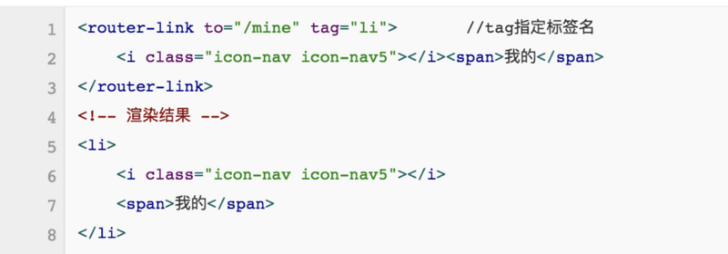

###vue中常用的一些技巧
1，给 props 属性设置多个类型，容错率大，更加人性化

    export default {
	    props: {
		    width: {
		      type: [String, Number],
		      default: '100px'
		    }
	    // 或者这样
	    // width: [String, Number] 
	    }
    }
    例：
    <template> 
	    <button :style="computedWidth">{{ computedWidth }}</button>
    </template>
    
    
2，watch的immediate属性

    created(){ 
	    this.fetchPostList()
    },
    watch: {
	    searchInputValue(){
		    this.fetchPostList()
	    }
    }
上面的这种写法我们可以完全如下写：

    watch: {
	    searchInputValue:{
		    handler: 'fetchPostList',
		    immediate: true 
	    }
	 }
3，使用promise，减少回调地狱

    axios.get("aaa")
    .then(res=>{
	    console.log(res);
	    axios.get("bbb",res)
	    .then(response=>{
		    axios.post("ccc",{})
		    .then(data()=>{
			    console.log(data);
		    })
	    })
    });

    axios.get("aaa")
    .then(res=>{
	    console.log(res);
	    return axios.get("bbb",res)
    })
    .then(res=>{
	    return axios.post("ccc",res)
    })
    .then(res=>{
	    console.log(res)
    })

4，v-for与v-if不要同时执行
	

    <ul>
	    <li v-for="(item,index) in list" key="index" v-if="show == true"></li>
    </ul>
    <ul v-if="show == true">
	    <li v-for="(item,index) in list" key="index"></li>
    </ul>
    <ul>
	    <li v-for="(item,index) in list" key="index">{{item.name}}</li>
    </ul>
    computed: {
	    list: function () {
		    return this.list.filter(function (list) {
			    return list.show
			  })
		 }
	}
5,动态路由传id

    {
        path:'/list/:id',
        name:'list',
        component:List,
        props:true
    }
    <template>
	    
{{id}}

    </template>
    

6,路由跳转的几种方式

	    //跳转到上一次浏览的页面
            this.$router.go(-1);
 
            //指定跳转的地址
            this.$router.replace('/menu')
 
            //指定跳转路由的名字下（路由name值）
            this.$router.replace({name:'menu'});
 
            //通过 push 进行跳转(最常用)
            this.$router.push('/menu');
            this.$router.push({name:'menu'});
7,路由跳转传参的坑
切记router.push的时候不要path和params一起用，params会失效，建议用query，如果非要用params，可以使用组件的name。而且一定要注意取数据的时候是route，不是router，千万不要被坑了，打印出来可以发现route是本路由的信息，而router是全局的router信息。
错误使用：
   
     this.$router.push({
	    path: "/a"
	    params:{}
    })
正确方式：

    this.$router.push({
	    path: "/a"
	    query:{}
    })
    this.$router.push({
	    name: "a"
	    params:{}
    })
            
8,尽量减少dom层级
router-link默认为我们设置了一个a标签，但是在实际场景可能不太实用，我们不访使用tag这一属性

